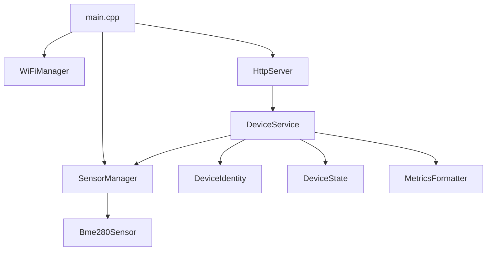

# ESP32 Sensor Node

ESP32 Sensor Node is a small firmware project for an ESP32-based environmental sensor. It reads data from a BME280 sensor, exposes device status through HTTP, and provides Prometheus-compatible metrics for Grafana dashboards.

The project is designed as a lightweight homelab observability node: each ESP32 can be provisioned with a stable device ID and hostname, discovered through mDNS, scraped by Prometheus, and visualized in Grafana.

## Features

- ESP32 WiFi connection with reconnect handling.
- Optional BME280 support for temperature, humidity, and pressure.
- HTTP API for health checks, JSON status, device information, provisioning, hostname updates, and reboot requests.
- Prometheus `/metrics` endpoint.
- Persistent device identity stored in ESP32 NVS using `Preferences`.
- mDNS support, for example `http://livingroom-sensor.local`.
- Helper provisioning script for scanning devices and assigning stable IDs and hostnames.
- Modular C++ structure: WiFi, HTTP, device service, identity, state, sensors, and metrics formatting are separated.

## Hardware

Typical setup:

- ESP32 development board.
- BME280 sensor module.
- WiFi network.
- Optional Prometheus and Grafana server for monitoring.

Typical BME280 wiring for many ESP32 development boards:

| BME280 | ESP32 |
|---|---|
| VIN / VCC | 3.3V |
| GND | GND |
| SDA | GPIO 21 |
| SCL | GPIO 22 |

The firmware calls `Wire.begin()` without custom pins, so it uses the default I2C pins for the selected ESP32 board. Adjust the code if your board uses different pins.

## Related repository

The observability stack for this project lives here:

[`weather-station-observability`](https://github.com/azargarov/weather-station-observability)

It contains Prometheus scrape configuration, Grafana dashboards, alert rules, and templates for running the monitoring stack locally.


## Project layout

The code is structured around a few simple responsibilities:



## Configuration

Runtime constants are stored in `config.h`.

Important options:

```cpp
constexpr uint32_t CPU_FREQ_MHZ = 240;
constexpr uint32_t SERIAL_BAUD = 115200;
constexpr uint32_t LOOP_DELAY_MS = 100;

constexpr bool BME280_ENABLED = true;
constexpr uint8_t BME280_I2C_ADDRESS = 0x76; // or 0x77
constexpr uint32_t SENSOR_READ_INTERVAL_MS = 5000;
```

WiFi credentials are expected in `secrets.h`, which should not be committed to Git.

Create `include/secrets.h` or another include path visible to PlatformIO:

```cpp
#pragma once

namespace Config {
constexpr const char *WIFI_SSID = "your-wifi-ssid";
constexpr const char *WIFI_PASSWORD = "your-wifi-password";
}
```

## Development workflow

A normal device workflow looks like this:

1. Configure WiFi credentials in `secrets.h`.
2. Build and flash the firmware.
3. Open the serial monitor and confirm that the device has joined WiFi.
4. Scan the LAN for ESP32 nodes.
5. Assign a stable device ID and hostname.
6. Reboot the device so the WiFi hostname and mDNS name are applied.
7. Verify HTTP, JSON, and Prometheus endpoints.
8. Add the device to Prometheus target discovery.
9. Build Grafana panels from the exported metrics.

## Build, flash, and monitor

This project is intended to be built with PlatformIO.

Build:

```bash
pio run
```

Upload to the ESP32:

```bash
pio run -t upload
```

Open serial monitor:

```bash
pio device monitor
```

During runtime, press `i` in the serial monitor to print current network information again.

If the repository has Makefile wrappers, the equivalent commands may be:

```bash
make build
make flash
make monitor
```

## First boot

On boot, the firmware:

1. Initializes device identity from NVS.
2. Sets CPU frequency.
3. Starts the serial console.
4. Probes the BME280 sensor.
5. Connects to WiFi.
6. Starts mDNS.
7. Starts the HTTP server on port `80`.

The serial output prints the hardware ID, provisioned ID, effective ID, IP address, RSSI, hostname, and mDNS URL.

Before provisioning, the device uses its hardware-derived ID as the effective ID and hostname. After provisioning, it uses the stored device ID and hostname.

## Device identity

Each ESP32 has a hardware ID derived from the chip eFuse MAC address:

```text
esp32-<chip-id>
```

A device can also be provisioned with a human-friendly ID and hostname. These values are stored in NVS under the `device` namespace.

The effective ID is selected like this:

```text
provisioned_id if set, otherwise hardware_id
```

The effective hostname is selected like this:

```text
hostname if set, otherwise effective_id
```

Device ID rules:

- Maximum length: 32 characters.
- Allowed characters: letters, numbers, `-`, `_`.

Hostname rules:

- Maximum length: 32 characters.
- Allowed characters: letters, numbers, `-`.
- Cannot start or end with `-`.

## Provisioning workflow

The preferred way to provision devices is to use the helper script:

```bash
python3 tools/provision/assign_id.py --subnet 192.168.1.0/24 --list
```

If you are already inside `tools/provision`, run it as:

```bash
python3 assign_id.py --subnet 192.168.1.0/24 --list
```

The script scans the subnet and calls each device's `/api/device/info` endpoint. Example output:

```text
IP               PROVISIONED  DEVICE_ID       HOSTNAME             HARDWARE_ID
--------------------------------------------------------------------------------------------
192.168.1.233    True         esp32-001       livingroom-sensor    esp32-3C772BA50528
192.168.1.234    False        -               esp32-3C772BA50910   esp32-3C772BA50910
```

### Install Python dependency

The script uses `requests`:

```bash
python3 -m pip install requests
```

Using a virtual environment is cleaner:

```bash
python3 -m venv .venv
source .venv/bin/activate
python3 -m pip install requests
```

### List devices

```bash
python3 tools/provision/assign_id.py --subnet 192.168.1.0/24 --list
```

Use this before assigning IDs. It shows IP address, provisioning state, current device ID, hostname, and hardware ID.

### Assign the next free ID

```bash
python3 tools/provision/assign_id.py \
  --subnet 192.168.1.0/24 \
  --assign-next \
  --ip 192.168.1.234 \
  --hostname balcony-sensor
```

By default, generated IDs use this pattern:

```text
esp32-001
esp32-002
esp32-003
```

The next free ID is calculated from already discovered device IDs.

### Assign a specific ID and hostname

```bash
python3 tools/provision/assign_id.py \
  --subnet 192.168.1.0/24 \
  --id esp32-002 \
  --hostname balcony-sensor \
  --ip 192.168.1.234
```

If `--hostname` is omitted, the hostname defaults to the assigned device ID.

### Target by hardware ID

If the device IP changes or multiple devices are found, target the physical board by hardware ID:

```bash
python3 tools/provision/assign_id.py \
  --subnet 192.168.1.0/24 \
  --id esp32-002 \
  --hostname balcony-sensor \
  --hwid esp32-3C772BA50528
```

This is useful when several new devices are online at the same time.

### Update hostname on an already provisioned device

Provisioning a device ID is intentionally one-time from the public API. Hostname can still be updated.

For already provisioned devices, use `--force`:

```bash
python3 tools/provision/assign_id.py \
  --subnet 192.168.1.0/24 \
  --id esp32-001 \
  --hostname livingroom-sensor \
  --ip 192.168.1.233 \
  --force
```

The script will only update the hostname if the existing device ID matches the requested `--id`.

### Reboot after provisioning

Provisioning and hostname changes are stored immediately, but the WiFi hostname and mDNS name are applied after reboot.

Reboot through the API:

```bash
curl -X POST http://192.168.1.233/api/device/reboot \
  -H 'Content-Type: application/json' \
  -d '{}' | jq
```

Or press the board reset button.

After reboot, verify mDNS:

```bash
curl http://livingroom-sensor.local/api/device/info | jq
```

If `.local` resolution does not work from Linux, make sure Avahi is installed and running:

```bash
systemctl status avahi-daemon
```

### Full example: adding a new balcony sensor

Flash the board:

```bash
pio run -t upload
pio device monitor
```

Scan the subnet:

```bash
python3 tools/provision/assign_id.py --subnet 192.168.1.0/24 --list
```

Assign ID and hostname:

```bash
python3 tools/provision/assign_id.py \
  --subnet 192.168.1.0/24 \
  --id esp32-002 \
  --hostname balcony-sensor \
  --ip 192.168.1.234
```

Reboot:

```bash
curl -X POST http://192.168.1.234/api/device/reboot \
  -H 'Content-Type: application/json' \
  -d '{}' | jq
```

Verify:

```bash
curl http://balcony-sensor.local/json | jq
curl http://balcony-sensor.local/metrics
```

Add it to Prometheus target discovery:

```yaml
- targets:
    - 192.168.1.234:80
  labels:
    device: esp32-balcony
    room: balcony
```

## HTTP API

Replace `192.168.1.233` with the actual ESP32 IP address or use the mDNS hostname.

### Text status

```bash
curl http://192.168.1.233/
```

Returns a human-readable status page with device identity, IP, uptime, and sensor values.

### Health check

```bash
curl http://192.168.1.233/healthz
```

Expected response:

```text
OK
```

### JSON status

```bash
curl http://192.168.1.233/json | jq
```

Example response:

```json
{
  "device_id": "esp32-001",
  "hardware_id": "esp32-6CD534A50528",
  "effective_id": "esp32-001",
  "hostname": "livingroom-sensor",
  "effective_hostname": "livingroom-sensor",
  "provisioned": true,
  "status": "ok",
  "ip": "192.168.1.233",
  "uptime_sec": 83387,
  "heap_free": 240760,
  "wifi_rssi": -86,
  "wifi_connected": true,
  "wifi_status": "connected",
  "sensors": {
    "bme280_available": true,
    "bme280_read_ok": true,
    "fields": {
      "temperature": 22.36,
      "humidity": 33.00195,
      "pressure": 1021.855
    },
    "units": {
      "temperature": "celsius",
      "humidity": "percent",
      "pressure": "hpa"
    }
  }
}
```

### Device info

```bash
curl http://192.168.1.233/api/device/info | jq
```

Returns identity and IP information only.

### Provision device manually

The Python script is preferred, but the API can also be called directly:

```bash
curl -X POST http://192.168.1.233/api/device/provision \
  -H 'Content-Type: application/json' \
  -d '{"device_id":"esp32-001","hostname":"livingroom-sensor"}' | jq
```

Successful response:

```json
{
  "device_id": "esp32-001",
  "hardware_id": "esp32-000000000000",
  "effective_id": "esp32-001",
  "hostname": "livingroom-sensor",
  "effective_hostname": "livingroom-sensor",
  "provisioned": true,
  "status": "ok",
  "note": "reboot_required_for_hostname_change"
}
```

Provisioning is currently a one-time operation. If the device already has a provisioned ID, the endpoint returns:

```json
{
  "error": "already_provisioned"
}
```

### Change hostname manually

```bash
curl -X POST http://192.168.1.233/api/device/hostname \
  -H 'Content-Type: application/json' \
  -d '{"hostname":"balcony-sensor"}' | jq
```

The new hostname is stored immediately, but a reboot is required before WiFi hostname and mDNS changes fully apply.

### Reboot device

```bash
curl -X POST http://192.168.1.233/api/device/reboot \
  -H 'Content-Type: application/json' \
  -d '{}' | jq
```

Expected response:

```json
{
  "status": "ok",
  "message": "reboot_scheduled"
}
```

The reboot is delayed briefly so the HTTP response can be sent before `ESP.restart()` is called.

## Prometheus metrics

Metrics are exposed at:

```bash
curl http://192.168.1.233/metrics
```

The endpoint returns Prometheus text format.

Current metrics include:

| Metric | Description |
|---|---|
| `esp32_up` | Firmware is running. |
| `esp32_wifi_connected` | WiFi connection status. |
| `esp32_uptime_seconds` | Time since boot. |
| `esp32_heap_free_bytes` | Free heap memory. |
| `esp32_wifi_rssi_dbm` | WiFi signal strength. |
| `esp32_wifi_status_info` | WiFi status as a labeled info metric. |
| `esp32_bme280_available` | Whether the BME280 sensor was detected. |
| `esp32_bme280_read_ok` | Whether the last BME280 read succeeded. |
| `esp32_sensor_temperature` | Temperature from the BME280 sensor. |
| `esp32_sensor_humidity` | Humidity from the BME280 sensor. |
| `esp32_sensor_pressure` | Pressure from the BME280 sensor. |

Device identity labels are added directly by the firmware:

```text
device_id="esp32-001",hardware_id="esp32-000000000000"
```

Sensor metrics also include a unit label:

```text
unit="celsius"
unit="percent"
unit="hpa"
```

## Prometheus scrape example

Example `prometheus.yml`:

```yaml
scrape_configs:
  - job_name: esp32
    scrape_interval: 15s
    file_sd_configs:
      - files:
          - /etc/prometheus/targets/esp32.yml
```

Example `/etc/prometheus/targets/esp32.yml`:

```yaml
- targets:
    - 192.168.1.233:80
  labels:
    device: esp32-lab
    room: livingroom

- targets:
    - 192.168.1.234:80
  labels:
    device: esp32-balcony
    room: balcony
```

The firmware-provided labels identify the physical ESP32. The Prometheus target labels are useful for logical placement, for example `room`, `floor`, `environment`, or `site`.

## Grafana ideas

Useful panels for this firmware:

- Indoor and outdoor temperature over time.
- Humidity over time.
- Pressure trend.
- WiFi RSSI by device.
- Free heap memory by device.
- Uptime by device.
- BME280 availability and read status.
- Temperature difference between indoor and outdoor sensors.

Example PromQL queries:

```promql
esp32_sensor_temperature{room="livingroom"}
esp32_sensor_temperature{room="balcony"}
esp32_sensor_humidity
esp32_sensor_pressure
esp32_wifi_rssi_dbm
esp32_heap_free_bytes
esp32_bme280_read_ok
```

Temperature difference example:

```promql
esp32_sensor_temperature{room="livingroom"} - ignoring(room) esp32_sensor_temperature{room="balcony"}
```

Depending on your labels, you may need to adjust the matching expression.

## Design notes

`HttpServer` is responsible for HTTP routing and response handling.

`DeviceService` owns application-level device operations: status generation, JSON generation, metrics generation, provisioning, hostname changes, and reboot scheduling.

`DeviceIdentity` owns persistent identity data stored in NVS.

`DeviceState` collects runtime state such as WiFi status, IP address, uptime, heap, and RSSI.

`SensorManager` owns sensor probing and periodic sensor updates.

`Bme280Sensor` owns the direct BME280 interaction.

`MetricsFormatter` converts current state and sensor fields into Prometheus text format.

This separation keeps HTTP code from knowing too much about identity, sensors, or metrics internals.

## Troubleshooting

### No devices found by `assign_id.py`

Check that:

- The ESP32 is connected to the same network as your computer.
- The firmware is running and the HTTP server started.
- The subnet is correct.
- Port `80` is reachable.
- The device responds to `/api/device/info`:

```bash
curl http://192.168.1.233/api/device/info | jq
```

### Multiple matching devices found

Use a narrower target:

```bash
python3 tools/provision/assign_id.py \
  --subnet 192.168.1.0/24 \
  --id esp32-002 \
  --hostname balcony-sensor \
  --ip 192.168.1.234
```

Or target the board by hardware ID:

```bash
python3 tools/provision/assign_id.py \
  --subnet 192.168.1.0/24 \
  --id esp32-002 \
  --hostname balcony-sensor \
  --hwid esp32-3C772BA50528
```

### Device is already provisioned

A provisioned ID cannot be changed through the provisioning endpoint. This is intentional to avoid accidentally renaming physical devices.

For hostname updates, keep the same `--id` and use `--force`:

```bash
python3 tools/provision/assign_id.py \
  --subnet 192.168.1.0/24 \
  --id esp32-001 \
  --hostname livingroom-sensor \
  --ip 192.168.1.233 \
  --force
```

### Hostname changed but `.local` still uses the old name

Reboot the device. The value is stored immediately, but WiFi hostname and mDNS are applied during connection startup.

```bash
curl -X POST http://192.168.1.233/api/device/reboot \
  -H 'Content-Type: application/json' \
  -d '{}' | jq
```

## Current limitations

- No authentication is implemented. Keep the device on a trusted LAN or isolated IoT network.
- Hostname changes require reboot before WiFi hostname and mDNS fully update.
- BME280 dynamic re-probing is prepared in the configuration, but the current update loop does not actively re-probe after boot.
- There is no OTA update support yet.

## Possible next steps

- Add automatic BME280 re-probing if the sensor is connected after boot.
- Add OTA firmware updates.
- Add a small OLED display for local status.
- Add motion-triggered display wake-up.
- Add MQTT support for low-power or event-driven publishing.
- Add deep sleep mode for battery-powered deployments.
- Add basic API authentication if the device is reachable from less trusted networks.
- Add GitHub Actions or local CI for formatting and build checks.

## License

MIT
