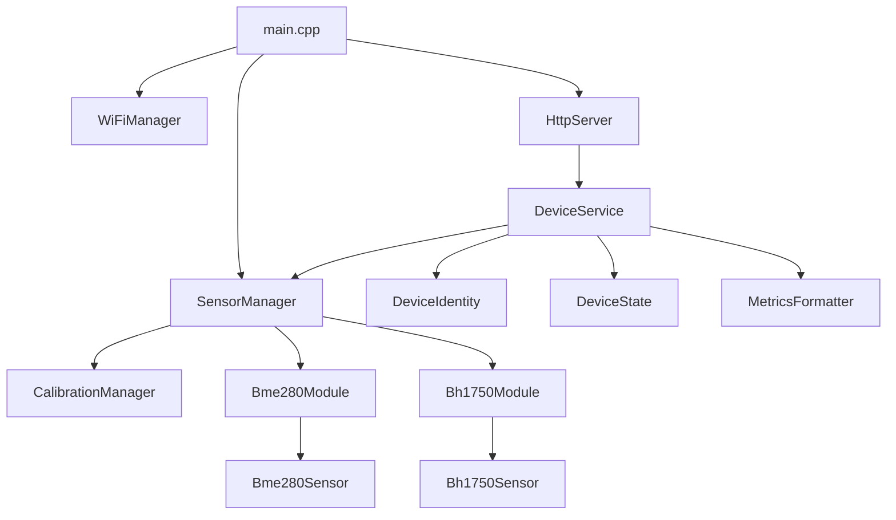

# ESP32 Sensor Node

ESP32 Sensor Node is a firmware project for ESP32-based environmental monitoring nodes.
It exposes device state and sensor data over HTTP, publishes Prometheus-compatible metrics, supports persistent device identity and sensor calibration, and is designed to fit into a small homelab observability setup.

The current branch supports:

- device provisioning with stable device IDs and hostnames
- mDNS discovery, for example `http://livingroom-sensor.local`
- Prometheus `/metrics` scraping
- JSON and text status endpoints
- persistent calibration profiles in ESP32 NVS
- optional BME280 and BH1750 sensor modules
- rolling 60-second statistics computed on the device

## Features

- Wi-Fi connection management with reconnect handling
- persistent device identity stored in NVS with `Preferences`
- HTTP API for health, ping, status, device info, provisioning, hostname updates, reboot, and calibration
- Prometheus metrics with stable identity labels
- modular sensor architecture with separate sensor modules behind a shared interface
- rolling sensor statistics: mean, median, min, max, range, stddev, slope, and sample count
- one-point and two-point calibration persisted across reboots
- helper provisioning script for scanning the subnet and assigning IDs and hostnames

## Related repository

The observability stack for this project lives here:

[`weather-station-observability`](https://github.com/azargarov/weather-station-observability)

It contains Prometheus scrape configuration, Grafana dashboards, alert rules, and templates for running the monitoring stack locally.

## Hardware

Typical setup:

- ESP32 development board
- optional BME280 sensor module
- optional BH1750 sensor module
- Wi-Fi network
- optional Prometheus and Grafana server for monitoring

### Typical I2C wiring

Both sensors use I2C and can share the same bus.
The firmware calls `Wire.begin()` without custom pins, so it uses the default I2C pins for the selected ESP32 board.
For many ESP32 development boards that means:

| Signal | ESP32 |
|---|---|
| SDA | GPIO 21 |
| SCL | GPIO 22 |
| 3.3V | 3.3V |
| GND | GND |

Example sensor wiring:

| Sensor | Pin | ESP32 |
|---|---|---|
| BME280 | VIN / VCC | 3.3V |
| BME280 | GND | GND |
| BME280 | SDA | GPIO 21 |
| BME280 | SCL | GPIO 22 |
| BH1750 | VCC | 3.3V |
| BH1750 | GND | GND |
| BH1750 | SDA | GPIO 21 |
| BH1750 | SCL | GPIO 22 |

Adjust the wiring if your board uses different default I2C pins.

## Project layout



## Current configuration defaults

Runtime constants are stored in `src/config.h`.

Current branch defaults:

```cpp
constexpr uint32_t CPU_FREQ_MHZ = 240;
constexpr uint32_t SERIAL_BAUD = 115200;
constexpr uint32_t LOOP_DELAY_MS = 1;

constexpr bool BME280_ENABLED = false;
constexpr uint8_t BME280_I2C_ADDRESS = 0x76;

constexpr bool BH1750_ENABLED = true;
constexpr uint8_t BH1750_I2C_ADDRESS = 0x23;

constexpr uint32_t SENSOR_READ_INTERVAL_MS = 1000;
constexpr uint32_t METRICS_CACHE_UPDATE_INTERVAL_MS = 1000;
constexpr uint32_t SENSOR_PROBE_INTERVAL_MS = 60000;
```

That means the branch currently defaults to BH1750 enabled and BME280 disabled.
If you want BME280 data, enable it in `src/config.h` before building.

### Wi-Fi credentials

Wi-Fi credentials are expected in `secrets.h`, which should not be committed.
Create `include/secrets.h` or another include path visible to PlatformIO:

```cpp
#pragma once

namespace Config {
constexpr const char *WIFI_SSID = "your-wifi-ssid";
constexpr const char *WIFI_PASSWORD = "your-wifi-password";
}
```

## Sensor behavior

### BME280

When enabled, the BME280 driver runs in forced mode.
Each read triggers a fresh measurement on demand.

Current BME280 sampling configuration:

- temperature: `SAMPLING_X1`
- pressure: `SAMPLING_X8`
- humidity: `SAMPLING_X1`
- filter: `FILTER_X4`

### BH1750

The BH1750 driver is initialized in continuous high-resolution mode.

### Re-probing behavior

Enabled sensor modules probe on boot.
If an enabled sensor is missing, the module retries probing every `SENSOR_PROBE_INTERVAL_MS`.
On the current branch, that interval is 60 seconds.

## Development workflow

A normal device workflow looks like this:

1. Configure Wi-Fi credentials in `secrets.h`
2. Adjust sensor enable flags in `src/config.h` if needed
3. Build and flash the firmware
4. Open the serial monitor and confirm that the device joined Wi-Fi
5. Scan the LAN for ESP32 nodes
6. Assign a stable device ID and hostname
7. Reboot the device so the Wi-Fi hostname and mDNS name are applied
8. Verify HTTP, JSON, and Prometheus endpoints
9. Add the device to Prometheus target discovery
10. Build Grafana dashboards from the exported metrics

## Build, flash, and monitor

This project is intended to be built with PlatformIO.

### Build

```bash
pio run
```

### Upload

```bash
pio run -t upload
```

### Serial monitor

```bash
pio device monitor
```

During runtime, press `i` in the serial monitor to print current network information again.

### Makefile wrappers

The repository also provides wrappers:

```bash
make build
make flash
make monitor
make check
make clean
```

To override the serial port with the Makefile:

```bash
make flash PORT=/dev/ttyUSB1
make monitor PORT=/dev/ttyUSB1
```

## First boot

On boot, the firmware:

1. initializes device identity from NVS
2. sets CPU frequency
3. starts the serial console
4. records the reset reason
5. starts sensor modules
6. connects to Wi-Fi
7. starts mDNS if Wi-Fi is connected
8. starts the HTTP server on port `80`
9. builds the initial metrics cache

The serial output prints the hardware ID, provisioned ID, effective ID, IP address, RSSI, hostname, and mDNS URL.

Before provisioning, the device uses its hardware-derived ID as the effective ID and hostname.
After provisioning, it uses the stored device ID and hostname.

## Device identity

Each ESP32 has a hardware ID derived from the chip eFuse MAC address:

```text
esp32-<chip-id>
```

A device can also be provisioned with a human-friendly ID and hostname.
These values are stored in NVS under the `device` namespace.

Selection rules:

```text
effective_id = provisioned_id if set, otherwise hardware_id
effective_hostname = hostname if set, otherwise effective_id
```

### Device ID rules

- maximum length: 32 characters
- allowed characters: letters, numbers, `-`, `_`

### Hostname rules

- maximum length: 32 characters
- allowed characters: letters, numbers, `-`
- cannot start or end with `-`

## Provisioning workflow

The preferred way to provision devices is to use the helper script:

```bash
python3 tools/provision/assign_id.py --subnet 192.168.1.0/24 --list
```

If you are already inside `tools/provision`, run it as:

```bash
python3 assign_id.py --subnet 192.168.1.0/24 --list
```

The script scans the subnet and calls each device's `/api/device/info` endpoint.

### Install Python dependency

The script uses `requests`:

```bash
python3 -m pip install requests
```

Using a virtual environment is cleaner:

```bash
python3 -m venv .venv
source .venv/bin/activate
python3 -m pip install requests
```

### List devices

```bash
python3 tools/provision/assign_id.py --subnet 192.168.1.0/24 --list
```

### Assign the next free ID

```bash
python3 tools/provision/assign_id.py \
  --subnet 192.168.1.0/24 \
  --assign-next \
  --ip 192.168.1.234 \
  --hostname balcony-sensor
```

Generated IDs use this pattern by default:

```text
esp32-001
esp32-002
esp32-003
```

### Assign a specific ID and hostname

```bash
python3 tools/provision/assign_id.py \
  --subnet 192.168.1.0/24 \
  --id esp32-002 \
  --hostname balcony-sensor \
  --ip 192.168.1.234
```

If `--hostname` is omitted, the hostname defaults to the assigned device ID.

### Target by hardware ID

```bash
python3 tools/provision/assign_id.py \
  --subnet 192.168.1.0/24 \
  --id esp32-002 \
  --hostname balcony-sensor \
  --hwid esp32-3C772BA50528
```

### Update hostname on an already provisioned device

Provisioning a device ID is intentionally one-time through the public API.
Hostname can still be updated.

For already provisioned devices, use `--force`:

```bash
python3 tools/provision/assign_id.py \
  --subnet 192.168.1.0/24 \
  --id esp32-001 \
  --hostname livingroom-sensor \
  --ip 192.168.1.233 \
  --force
```

The script only updates the hostname if the existing device ID matches the requested `--id`.

### Reboot after provisioning

Provisioning and hostname changes are stored immediately, but the Wi-Fi hostname and mDNS name are applied after reboot.

```bash
curl -X POST http://192.168.1.233/api/device/reboot \
  -H 'Content-Type: application/json' \
  -d '{}' | jq
```

After reboot, verify mDNS:

```bash
curl http://livingroom-sensor.local/api/device/info | jq
```

If `.local` resolution does not work from Linux, make sure Avahi is installed and running:

```bash
systemctl status avahi-daemon
```

## HTTP API

Replace `192.168.1.233` with the actual device IP or the mDNS hostname.

### Text status

```bash
curl http://192.168.1.233/
```

Returns a human-readable status page with identity, IP, uptime, and current exported field values.

### Health check

```bash
curl http://192.168.1.233/healthz
```

Expected response:

```text
OK
```

### Ping

```bash
curl http://192.168.1.233/ping
```

Expected response:

```text
ok
```

### JSON status

```bash
curl http://192.168.1.233/json | jq
```

Typical structure:

```json
{
  "device_id": "esp32-001",
  "hardware_id": "esp32-6CD534A50528",
  "effective_id": "esp32-001",
  "hostname": "livingroom-sensor",
  "effective_hostname": "livingroom-sensor",
  "provisioned": true,
  "status": "ok",
  "ip": "192.168.1.233",
  "uptime_sec": 12345,
  "heap_free": 230000,
  "wifi_rssi": -54,
  "wifi_connected": true,
  "wifi_status": "connected",
  "sensors": {
    "bme280_available": false,
    "bme280_read_ok": false,
    "bh1750_available": true,
    "bh1750_read_ok": true,
    "fields": {
      "illuminance_mean_60s": {
        "value": 123.4,
        "unit": "lux"
      },
      "illuminance_median_60s": {
        "value": 120.9,
        "unit": "lux"
      }
    }
  }
}
```

The exact `fields` object depends on which sensors are enabled and currently producing valid data.

### Device info

```bash
curl http://192.168.1.233/api/device/info | jq
```

This endpoint returns identity and IP information plus reset-reason data.

### Provision device manually

```bash
curl -X POST http://192.168.1.233/api/device/provision \
  -H 'Content-Type: application/json' \
  -d '{"device_id":"esp32-001","hostname":"livingroom-sensor"}' | jq
```

Successful response shape:

```json
{
  "device_id": "esp32-001",
  "hardware_id": "esp32-000000000000",
  "effective_id": "esp32-001",
  "hostname": "livingroom-sensor",
  "effective_hostname": "livingroom-sensor",
  "provisioned": true,
  "status": "ok",
  "note": "reboot_required_for_hostname_change"
}
```

If the device is already provisioned, the endpoint returns:

```json
{
  "error": "already_provisioned"
}
```

### Change hostname manually

```bash
curl -X POST http://192.168.1.233/api/device/hostname \
  -H 'Content-Type: application/json' \
  -d '{"hostname":"balcony-sensor"}' | jq
```

The new hostname is stored immediately, but a reboot is required before Wi-Fi hostname and mDNS changes fully apply.

### Reboot device

```bash
curl -X POST http://192.168.1.233/api/device/reboot \
  -H 'Content-Type: application/json' \
  -d '{}' | jq
```

Expected response:

```json
{
  "status": "ok",
  "message": "reboot_scheduled"
}
```

The reboot is delayed briefly so the HTTP response can be sent before `ESP.restart()` is called.

## Calibration API

Calibration routes are handled dynamically under:

```text
GET  /api/sensors/<sensor>/calibration
POST /api/sensors/<sensor>/<field>/calibration
```

Sensor and field names are case-sensitive.

### Supported sensor names

- `bme280`
- `bh1750`

### Supported calibration fields

For `bme280`:

- `temperature`
- `humidity`
- `pressure`

For `bh1750`:

- `illuminance`

### Read current calibration

```bash
curl http://192.168.1.233/api/sensors/bme280/calibration | jq
curl http://192.168.1.233/api/sensors/bh1750/calibration | jq
```

### Set calibration point

Each calibration request must include:

- `reference`: trusted reference value
- `point`: calibration point index, either `1` or `2`

Example for BME280 temperature:

```bash
curl -X POST http://192.168.1.233/api/sensors/bme280/temperature/calibration \
  -H 'Content-Type: application/json' \
  -d '{"reference": 22.7, "point": 1}' | jq
```

Example for BH1750 illuminance:

```bash
curl -X POST http://192.168.1.233/api/sensors/bh1750/illuminance/calibration \
  -H 'Content-Type: application/json' \
  -d '{"reference": 320.0, "point": 1}' | jq
```

### Calibration behavior

- one stored point produces offset calibration
- two stored points produce linear two-point calibration
- calibration profiles are stored in NVS and restored after reboot
- calibration data remains available even if the physical sensor is currently missing
- calibration can only be updated when a valid current reading is available for the target field

Single-point calibration:

```text
offset = reference - raw
corrected = raw + offset
```

Two-point calibration:

```text
scale = (ref2 - ref1) / (raw2 - raw1)
offset = ref1 - scale * raw1
corrected = scale * raw + offset
```

## Prometheus metrics

Metrics are exposed at:

```bash
curl http://192.168.1.233/metrics
```

The endpoint returns Prometheus text format and serves a cached response rebuilt in the main loop.

### Core device metrics

- `esp32_up`
- `esp32_wifi_connected`
- `esp32_uptime_seconds`
- `esp32_heap_free_bytes`
- `esp32_wifi_rssi_dbm`
- `esp32_wifi_status_info`
- `esp32_metrics_build_duration_ms`
- `esp32_metrics_last_build_uptime_seconds`

All metrics include firmware-provided identity labels:

```text
device_id="esp32-001",hardware_id="esp32-000000000000"
```

### Sensor state metrics

Per-sensor availability, last-read status, and read-error counters are exposed as dedicated metrics:

- `esp32_sensor_bme280_available`
- `esp32_sensor_bme280_read_ok`
- `esp32_sensor_bme280_read_errors_total`
- `esp32_sensor_bh1750_available`
- `esp32_sensor_bh1750_read_ok`
- `esp32_sensor_bh1750_read_errors_total`

### Rolling sensor statistic families

Measured values are exported through shared metric families with labels describing the sensor and field:

- `esp32_sensor_mean_60s`
- `esp32_sensor_median_60s`
- `esp32_sensor_min_60s`
- `esp32_sensor_max_60s`
- `esp32_sensor_range_60s`
- `esp32_sensor_stddev_60s`
- `esp32_sensor_slope_per_minute_60s`
- `esp32_sensor_samples_60s`

Typical labels:

```text
sensor="bme280",field="temperature",unit="celsius"
sensor="bme280",field="humidity",unit="percent"
sensor="bme280",field="pressure",unit="hpa"
sensor="bh1750",field="illuminance",unit="lux"
```

Example:

```text
esp32_sensor_mean_60s{device_id="esp32-001",hardware_id="esp32-000000000000",sensor="bh1750",field="illuminance",unit="lux"} 123.4
```

### Calibration metrics

Calibration state is exported per sensor field:

- `esp32_sensor_calibration_enabled`
- `esp32_sensor_calibration_scale`
- `esp32_sensor_calibration_offset`
- `esp32_sensor_calibration_mode`

Calibration mode values:

- `0` = none
- `1` = offset
- `2` = two-point

Example:

```text
esp32_sensor_calibration_scale{device_id="esp32-001",hardware_id="esp32-000000000000",sensor="bh1750",field="illuminance"} 1
esp32_sensor_calibration_offset{device_id="esp32-001",hardware_id="esp32-000000000000",sensor="bh1750",field="illuminance",unit="lux"} 0
```

### Metrics cache age

The metrics cache rebuild interval is controlled by:

```cpp
constexpr uint32_t METRICS_CACHE_UPDATE_INTERVAL_MS = 1000;
```

You can derive cache age in Prometheus:

```promql
esp32_uptime_seconds - esp32_metrics_last_build_uptime_seconds
```

## Prometheus scrape example

Example `prometheus.yml`:

```yaml
scrape_configs:
  - job_name: esp32
    scrape_interval: 15s
    file_sd_configs:
      - files:
          - /etc/prometheus/targets/esp32.yml
```

Example `/etc/prometheus/targets/esp32.yml`:

```yaml
- targets:
    - 192.168.1.233:80
  labels:
    device: esp32-lab
    room: livingroom

- targets:
    - 192.168.1.234:80
  labels:
    device: esp32-balcony
    room: balcony
```

The firmware-provided labels identify the physical device.
Prometheus target labels are useful for logical placement such as `room`, `floor`, `environment`, or `site`.

## Design notes

- `HttpServer` handles routing and response dispatch
- `DeviceService` owns status generation, metrics generation, provisioning, hostname changes, and reboot scheduling
- `DeviceIdentity` owns persistent identity data in NVS
- `DeviceState` collects runtime state such as Wi-Fi status, IP, uptime, heap, and RSSI
- `SensorManager` owns sensor modules and delegates updates, field walking, metrics walking, and calibration lookup
- `CalibrationManager` owns calibration storage, recalculation, and JSON export
- `Bme280Module` and `Bh1750Module` adapt sensor-specific logic into a shared module interface
- `MetricsFormatter` converts state and sensor metrics into Prometheus text format

This keeps HTTP code from knowing too much about identity, sensor internals, or metrics formatting.

## Troubleshooting

### No devices found by `assign_id.py`

Check that:

- the ESP32 is connected to the same network as your computer
- the firmware is running and the HTTP server started
- the subnet is correct
- port `80` is reachable
- the device responds to `/api/device/info`

```bash
curl http://192.168.1.233/api/device/info | jq
```

### Multiple matching devices found

Use a narrower target:

```bash
python3 tools/provision/assign_id.py \
  --subnet 192.168.1.0/24 \
  --id esp32-002 \
  --hostname balcony-sensor \
  --ip 192.168.1.234
```

Or target the board by hardware ID:

```bash
python3 tools/provision/assign_id.py \
  --subnet 192.168.1.0/24 \
  --id esp32-002 \
  --hostname balcony-sensor \
  --hwid esp32-3C772BA50528
```

### Device is already provisioned

A provisioned ID cannot be changed through the provisioning endpoint.
For hostname updates, keep the same `--id` and use `--force`.

### Hostname changed but `.local` still uses the old name

Reboot the device.
The value is stored immediately, but Wi-Fi hostname and mDNS are applied during connection startup.

```bash
curl -X POST http://192.168.1.233/api/device/reboot \
  -H 'Content-Type: application/json' \
  -d '{}' | jq
```

### Sensor is enabled but no data appears

Check these points:

- the sensor is actually enabled in `src/config.h`
- the I2C address matches the module, for example `0x76` or `0x77` for BME280 and `0x23` for BH1750 on the current branch
- wiring and power are correct
- the serial log shows successful probe messages
- enough time has passed for the next automatic re-probe if the sensor was absent at boot

## Current limitations

- no authentication is implemented, so keep the device on a trusted LAN or isolated IoT network
- hostname changes require reboot before Wi-Fi hostname and mDNS fully update
- calibration updates require a valid current reading for the target field
- there is no OTA update support yet
- sensor registration is still static in code rather than fully data-driven

## Possible next steps

- add OTA firmware updates
- add API authentication for less trusted networks
- add a small OLED display for local status
- add ADC-backed supply-voltage reporting as a surfaced sensor module
- make sensor registration more dynamic
- add GitHub Actions CI for build and checks
- add deep sleep mode for battery-powered deployments
- add MQTT support for event-driven or low-power use cases

## License

MIT
